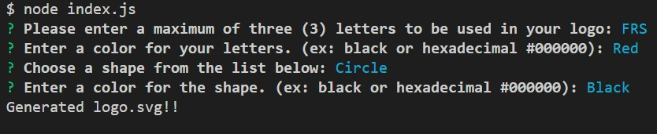

# SVG_Logo_Generator
 

  
## Description
  
A command line interface that allows an user create a svg logo base on the answered questions.  

## Table of Contents

  - [Installation](#Installation)
  - [Usage](#Usage)
  - [License](#License)
  - [Contrubutions](#Contributions)
  - [Test](#Test)
  - [Questions](#Questions)

## Installation

This application requires: node.js and Inquirer npm.

## Usage

To use the svg logo generator, you you will have to use a terminal or git bash. To start the application use **node index.js** and answer each of the questions. After finished all question a message with the status will appear and a logo.svg file will be created.

[Walkthrough video link here!](https://drive.google.com/file/d/121cDeP6HehVxg0vQhU8e9pZ-65ai8Ryj/view?usp=sharing)

The folowing picture shows the funstionality of the application

The following picture show an example

## Credits

* [Scalable Vector Graphics (SVG)](https://en.wikipedia.org/wiki/Scalable_Vector_Graphics)
* [SVG Tutorial](https://developer.mozilla.org/en-US/docs/Web/SVG/Tutorial)
* [Basic SVG Shapes](https://developer.mozilla.org/en-US/docs/Web/SVG/Tutorial/Basic_Shapes)

## License

This project is licensed under the MIT license.

## Contributing

No contribubutions guidelines.

## Test

Test available for shapes. On the command line interface run: npm run test

## Questions

[github.com/FranklynSuriel](https://github.com/FranklynSuriel)

Questions about this proyect or to report an issue can be sent to:
fsuriel@gmail.com. Please especify the name of the proyect in the subject of the email.